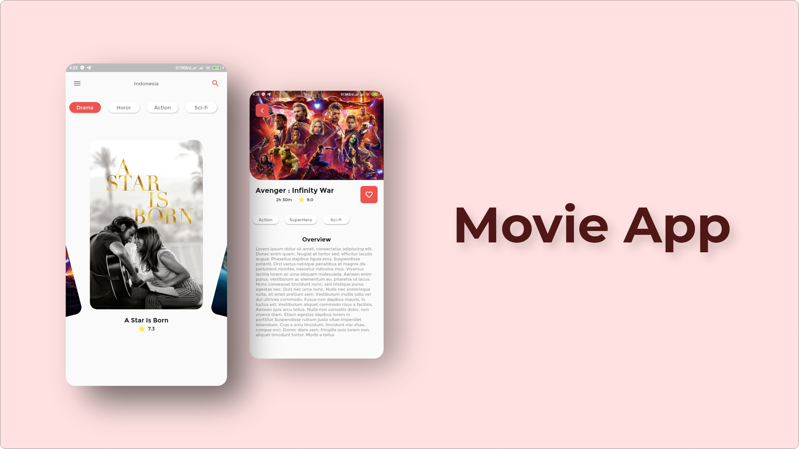

<h1 align="center">
  Submission Dicoding Flutter Pemula : Movie App
</h1>

<p align="center">
  Submission Flutter Pemula in Dicoding Course.
</p>

<p align="center">
  <a href="http://developer.android.com/index.html"></a>
  <a href="https://www.apple.com/"></a>
  <a href="http://kotlinlang.org"></a>
  <a href="https://github.com/Adithya-13/SubmissionFlutterPemula/"></a>
</p>

<p align="center">
  
</p>

## Table of Contents
- [Introduction](#introduction)
- [Installation](#installation)
- [Demo](#demo)
- [Features](#features)
- [Dependencies](#dependencies)

## Introduction

This project is made to fulfill a Submission in Dicoding course.

In this project, i learned to made a beautiful UI in flutter. For the 3rd Party Library i used in this project, you can look [here](#dependencies), i Used the dummyData for DataSource that u can see in [here](https://github.com/Adithya-13/SubmissionFlutterPemula/tree/master/assets/images)

I Hope this Project will help someone, if you feel helped with this project, you can give stars to support me, thank you very much :)

## Installation

Clone or Download and Open it into Android Studio
```
    https://github.com/Adithya-13/SubmissionFlutterPemula.git
```  

## Demo

|All Movies|Detail Movies|
|--|--|
|||

## Features
- Get All the Movies
- Toggle Favorite Movies
- Detail Movies

## Dependencies
- [Auto Size Text](https://pub.dev/packages/auto_size_text)
- [Flutter Swiper](https://pub.dev/packages/flutter_swiper)
